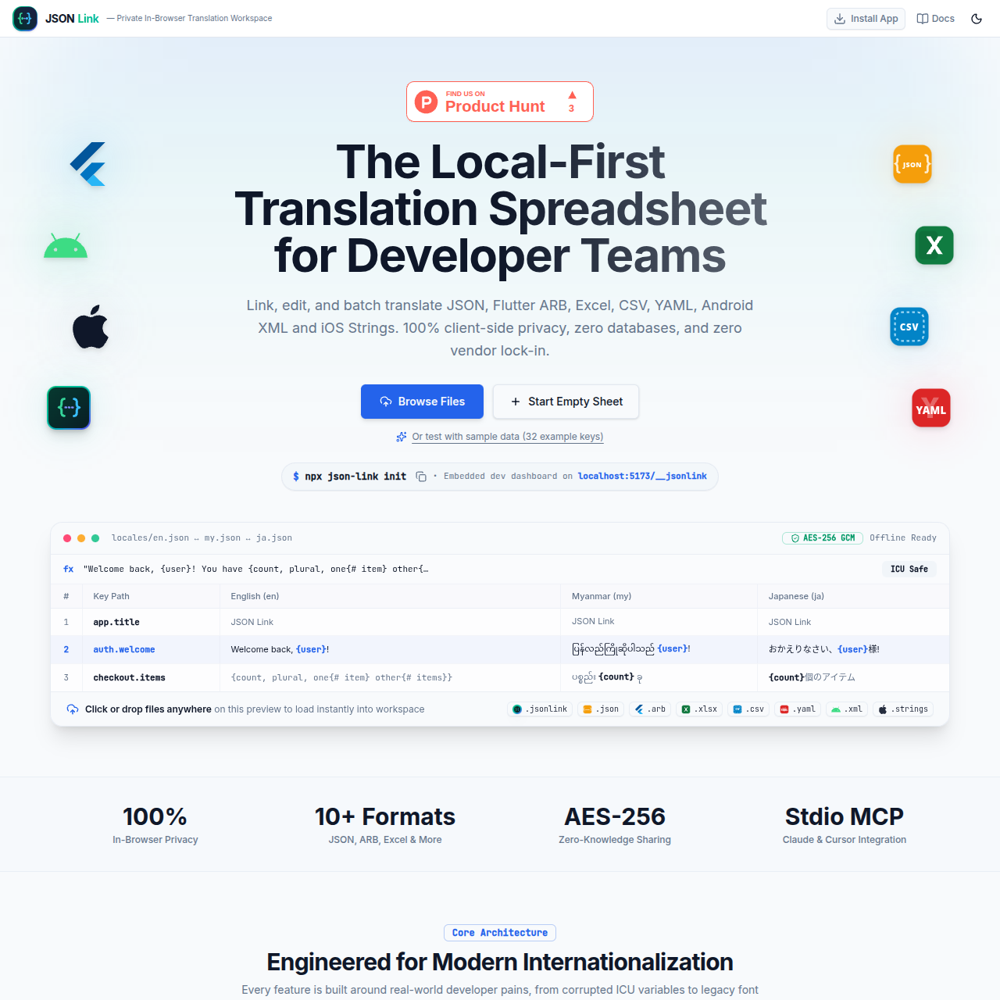

<div align="center">
  
  <h1>JSON Link</h1>
  <p><strong>The Local-First Localization Workspace for Software Teams & AI Coding Assistants</strong></p>
  <p>Zero-backend spreadsheet studio, two-way disk synchronization, lossless AST variable protection, and native Model Context Protocol (MCP) server.</p>

  <p>
    <a href="https://github.com/pyaephyomaungdev/json-link/releases/tag/v1.1.0"></a>
    <a href="https://json-link.pages.dev"></a>
    <a href="https://www.npmjs.com/package/create-jsonlink"></a>
    <a href="https://github.com/pyaephyomaungdev/json-link/actions"></a>
    <a href="SECURITY.md"></a>
    <a href="LICENSE"></a>
    <a href="https://github.com/pyaephyomaungdev/json-link"></a>
  </p>

  <p>
    <a href="https://stackscope.dev/launch/f9r3myum/json-link"></a>
    <a href="https://www.buymeacoffee.com/pyaephyomaa"></a>
  </p>

  <p>
    <a href="#quickstart">Quickstart</a> •
    <a href="#why-json-link">Why JSON Link?</a> •
    <a href="#core-ecosystem">Ecosystem Packages</a> •
    <a href="#feature-tour">Feature Tour</a> •
    <a href="#developer-integration-react--vite">Developer Guide</a> •
    <a href="#community--contributing">Contributing</a> •
    <a href="#security-policy">Security</a> •
    <a href="#testing--verification">Tests & CI</a> •
    <a href="#changelog">Changelog</a>
  </p>
</div>

---

<p align="center">
  
</p>

---

##  Quickstart

Choose how you want to run JSON Link:

### 1. Scaffold a New Localized React App
```bash
npm create jsonlink my-app
# or
npx create-jsonlink my-app
```
*Creates a production-ready React 19 + TypeScript + Vite project preconfigured with bilingual switching (`en`, `my`) and the live translation devtool at `http://localhost:5173/__jsonlink`.*

### 2. Inject into an Existing React + Vite Project
```bash
npx create-jsonlink
```
*Auto-detects your `vite.config.ts`, patches `jsonLink()` devtool, and scaffolds `src/locales/` with zero configuration.*

### 3. Connect AI Assistants via Model Context Protocol (MCP)
Add this 1-line configuration to **Claude Desktop**, **Cursor** (`.cursor/mcp.json`), or **Antigravity**:
```json
{
  "mcpServers": {
    "json-link": {
      "command": "npx",
      "args": ["-y", "@jsonlink/mcp"]
    }
  }
}
```

### 4. Or Launch the Web Studio in Any Browser
👉 **[Open json-link.pages.dev](https://json-link.pages.dev)** *(100% client-side, zero backend, works offline)*

---

##  Why JSON Link?

| Capability | Google Sheets / Excel | Cloud SaaS ($50–$400/mo) | JSON Link (Open Source) |
| :--- | :--- | :--- | :--- |
| **Interpolation Safety** (`{user}`, `%s`) |  Translators corrupt variables |  Complex regex setups |  **Visual chips & live linter** |
| **Local Disk Sync & HMR** |  Manual export & copy-paste |  CLI polling / webhooks |  **Direct disk write (`Cmd+S`) with instant Vite HMR** |
| **Developer Overhead** |  Heavy glue scripts |  Vendor lock-in & SDK bloat |  **~120-line reactive client, 0 external runtime deps** |
| **AI Translation (BYOK)** |  None |  High per-token markup |  **Direct OpenRouter (Gemini, Claude, DeepSeek)** |
| **P2P Live Collaboration** |  No real-time co-authoring |  Requires paid cloud seats ($15–$50/seat) |  **WebRTC DataChannels + Yjs CRDT (signaling relay to connect; optional AES-GCM E2EE)** |
| **Data Privacy & Storage** |  Plaintext on external cloud |  Third-party server hosting |  **100% Client-Side AES-GCM 256 + Zero Backend** |
| **AI Coding Assistant Tools** |  None |  None |  **Native Model Context Protocol (MCP) server** |
| **Myanmar Font Support** |  Garbled Zawgyi rendering |  Unsupported |  **Heuristic Rabbit Zawgyi ⇄ Unicode converter** |
| **Pricing** | Free with manual friction | Expensive recurring seat fees |  **Free forever (MIT License)** |

---

##  Core Ecosystem

| Package | npm | Role |
| :--- | :--- | :--- |
| **[`create-jsonlink`](packages/create-jsonlink/)** | `npm create jsonlink` | Zero-setup project starter and existing repo initializer |
| **[`@jsonlink/vite-plugin`](packages/vite-plugin/)** | `npm i -D @jsonlink/vite-plugin` | Vite dev middleware serving `/__jsonlink` with direct disk synchronization |
| **[`@jsonlink/mcp`](mcp/)** | `npx -y @jsonlink/mcp` | stdio JSON-RPC 2.0 MCP server for Cursor, Claude Desktop, and Antigravity |

---

## Feature Tour

<details>
<summary><strong> 1. Authentic Spreadsheet Grid & Keyboard Navigation</strong> (Click to expand)</summary>

* **Edge-to-Edge Grid**: Full viewport spreadsheet with zero outer margins, clean gridlines, row numbers (`1, 2, 3...`), and column letters (`A, B, C...`).
* **Zero-Dependency DOM Virtualization (`useVirtualRows`)**: Smooth 60fps windowing engine rendering 5,000+ translation keys with sub-500 active DOM elements and zero typing input lag.
* **Freeze Panes**:
  * Sticky Top: Headers stay pinned during vertical scrolling.
  * Freeze Left: Key column stays fixed while scrolling horizontally across languages.
  * Custom Pinning: Pin any language column with 1 click from the header dropdown.
* **Formula Bar (`fx`)**: Inspect active cell coordinates (e.g., `B14 [en]`) with full-width multiline editing.
* **Keyboard Navigation**: Familiar Excel arrow keys (`↑`, `↓`, `←`, `→`), `Tab` / `Shift+Tab` cell jump, and `Enter` to commit and advance.
* **1-Click Revert Chip (`↺`)**: Modified or newly translated cells show an interactive rollback chip to revert back to disk/imported state.
* **Multi-Cell Copy & Paste**: Paste tab-separated or newline-delimited text from Google Sheets or Excel seamlessly.
* **Time Machine**: 50-step historical snapshot engine (`Cmd+Z` / `Cmd+Shift+Z`).

</details>

<details>
<summary><strong> 2. AST Tokenizer & Real-time QA Consistency Linter</strong> (Click to expand)</summary>

* **Token Protection Engine**: Automatically tokenizes interpolation variables into indestructible visual chips:
  * ICU MessageFormat: `{name}`, `{count, plural, one{# item} other{# items}}`
  * Mustache / Handlebars: `{{username}}`, `{{total}}`
  * Printf syntax: `%s`, `%1$s`, `%(user)d`
  * Positional variables: `$1`, `$2`
* **Real-time QA Linter**:
  * **Missing Variables**: Flags any translation missing variables present in source strings.
  * **Whitespace Cleaner**: 1-click "Fix All Whitespace" trims leading/trailing spaces across all keys.
  * **Text Expansion Warning**: Highlights translations exceeding 2.5x source length to prevent mobile UI button clipping.
  * **Untranslated & Duplicate Detector**: Pinpoints identical strings and unmigrated keys.
  * **Jump to Cell**: Click any issue row in the linter modal to automatically select and focus that cell in the grid.

</details>

<details>
<summary><strong> 3. Two-Way Disk Synchronization & Instant Vite HMR</strong> (Click to expand)</summary>

* **Native File System Access API**: Connects directly to local folders (`src/locales/` or `assets/l10n/`).
* **Instant Disk Sync**: Press `Cmd+S` or `Ctrl+S` — changes write directly to `.json` files on your local drive with zero download prompts.
* **Zero Production Overhead**: The devtool runs exclusively in `vite dev` (`apply: 'serve'`). In production builds (`npm run build`), zero runtime bytes from JSON Link are bundled.
* **Live Type Generation**: Every disk save regenerates `translations.d.ts` with strict TypeScript literal union types.

</details>

<details>
<summary><strong> 4. Model Context Protocol (MCP) Server for AI Assistants</strong> (Click to expand)</summary>

Connects directly to **Claude Desktop**, **Cursor**, **Windsurf**, and **Google Antigravity** via stdio JSON-RPC 2.0:

* `validate_variables`: Verifies interpolation token integrity across files.
* `convert_zawgyi`: Lossless Rabbit encoding conversion.
* `lint_translations`: Automated headless QA audit for CI or chat prompts.
* `read_translations`: Unified parser across JSON, ARB, XML, Strings, YAML, and CSV.
* `export_bundle`: Multi-platform code generation.

**Configuration in `.cursor/mcp.json` or Claude Desktop:**
```json
{
  "mcpServers": {
    "json-link": {
      "command": "npx",
      "args": ["-y", "@jsonlink/mcp"]
    }
  }
}
```

</details>

<details>
<summary><strong> 5. Zero-Knowledge E2EE Sharing & Team Handoff (.jsonlink)</strong> (Click to expand)</summary>

* **Zero-Storage URL Fragment Sharing (`#share=...`)**:
  * Entire multi-language workspace states are compressed in-browser via DEFLATE (`pako`) and encoded into the URL hash fragment.
  * Zero server storage, zero database overhead. Plaintext data never transits an intermediary server.
* **Client-Side AES-GCM 256-bit Password Encryption**:
  * Optional password protection using PBKDF2-SHA256 (100,000 iterations), 16-byte cryptographic salt, and 12-byte IV.
  * Available across URL shares, standalone `.jsonlink` file backups, and workspace exit guards.
* **Automated Decryption Dialog**: Opening an encrypted URL triggers password prompts with cryptographic authentication tag verification.

</details>

<details>
<summary><strong> 6. Lossless Myanmar Zawgyi ⇄ Unicode Engine</strong> (Click to expand)</summary>

* **Heuristic Font Detector**: Analyzes text ordering, vowel markers, and medials to automatically detect legacy Zawgyi encoding.
* **Warning Header Badges**: Displays a Zawgyi warning pill on affected language columns.
* **Rabbit Transcoder**:
  * **Zawgyi → Unicode**: One-click conversion reordering syllables to international Myanmar Unicode standards.
  * **Unicode → Zawgyi**: Transcodes clean Unicode back to Zawgyi for testing on legacy Android forks.

</details>

<details>
<summary><strong> 7. Universal Multi-Platform Exporters</strong> (Click to expand)</summary>

One-click multi-format bundle exporter transpiling simultaneously into:
* **Web & Next.js**: `locales/{lang}.json` (flat or nested)
* **Flutter**: `flutter-l10n/app_{lang}.arb` (preserves `@key` descriptions & placeholders)
* **iOS / Xcode**: `ios-strings/{lang}.lproj/Localizable.strings` (with C-style comments)
* **Android**: `android-res/values-{lang}/strings.xml` (with XML resource comments)
* **TypeScript**: `translations.d.ts` (strict type-safe unions)
* **Spreadsheets**: Excel `.xlsx` (auto-sized columns) and UTF-8 BOM `.csv`
* **Server**: YAML `.yaml`

</details>

<details>
<summary><strong> 8. GitHub Branch Discovery & Automated Pull Requests</strong> (Click to expand)</summary>

* **Zero-Setup Client-Side Sync**: Connects to public or private repositories using a GitHub Personal Access Token (stored only in browser `localStorage`).
* **Git Tree Locales Discovery**: Recursively scans repo branches to detect existing localization files (`locales/`, `i18n/`, `values-*/`, etc.).
* **Automated Feature Branch & PR Creation**: Commits updated translations to a dedicated branch (`jsonlink/translations-...`) and opens a Pull Request with a clear markdown diff summary.
* **Safety Guardrails**: Security filters permanently block read/write operations outside translation paths (e.g., blocking `src/`, `.env*`, `.github/`).

</details>

<details>
<summary><strong> 9. Serverless WebRTC Live Collaboration & Peer Awareness</strong> (Click to expand)</summary>

* **Peer Data over WebRTC**: Multi-user co-authoring powered by Yjs Conflict-Free Replicated Data Types (CRDT) and direct WebRTC DataChannels. Public/local signaling relays are used solely for initial peer handshakes; all keystrokes and translation edits stream peer-to-peer with zero server storage.
* **Optional End-to-End Encryption (E2EE)**: Setting an optional room password derives 256-bit AES-GCM encryption keys using client-side PBKDF2-SHA256 (100,000 iterations). When enabled, document updates and awareness messages are completely unreadable to intermediary signaling relays. Open rooms without a PIN remain unencrypted for instant frictionless sharing.
* **Human-Friendly Room IDs**: Canonical hyphenated 3-4-3 segmented room format (e.g., `yfq-khjt-efn`) with smart alphanumeric normalization.
* **Live Peer Awareness & Follow Mode**: Real-time cursor coordinates with deterministic peer palette assignment (12 distinct colors), user avatar initials badges, and one-click viewport jump to follow collaborator selections.
* **Figma-Style Live Multiplayer Cursors**: Ultra-fluid ~33fps mouse pointer tracking with high-contrast colored arrow pointers (↖) and peer name pill badges. Pointers are mapped to spreadsheet canvas coordinates, automatically fade after 3 seconds of inactivity, and cleanly slide underneath sticky table headers when scrolling.
* **Full Data Sync & Independent Filter Views**: Synchronizes translation cells, developer context notes, review statuses (Draft/Needs Review/Approved), and project metadata in real time, while keeping personal filter views (namespace, search, missing keys) independent per peer so collaborators never disrupt each other's focus.
* **Dedicated Multi-Stage Auth Modals**: Clean separate screens for PIN entry, connection loading with spinner, and authentication failure recovery with auto-focused "Try Again".

</details>

---

##  Developer Integration (React + Vite)

JSON Link provides an ultra-lightweight, zero-dependency reactive client loader (`i18n.ts`):

```tsx
// src/App.tsx
import { useTranslation } from './locales/i18n';

export function App() {
  const { t, language, setLanguage, languages } = useTranslation();

  return (
    <div>
      {/* Type-safe key autocomplete with variable interpolation */}
      <h1>{t('app.title')}</h1>
      <p>{t('auth.welcome', { username: 'Developer' })}</p>

      {/* Reactive language switcher */}
      <div className="flex gap-2">
        {languages.map((lang) => (
          <button
            key={lang}
            className={language === lang ? 'active' : ''}
            onClick={() => setLanguage(lang)}
          >
            {lang === 'en' ? 'English' : 'မြန်မာ'}
          </button>
        ))}
      </div>
    </div>
  );
}
```

```typescript
// vite.config.ts
import { defineConfig } from 'vite';
import react from '@vitejs/plugin-react';
import { jsonLink } from '@jsonlink/vite-plugin';

export default defineConfig({
  plugins: [
    react(),
    jsonLink({
      localesDir: './src/locales',
      route: '/__jsonlink', // open devtool at http://localhost:5173/__jsonlink
    }),
  ],
});
```

---

##  Testing & Verification

Quality and zero-regression architecture are guaranteed via automated test suites in Vitest:

```bash
npm test
```

```
 ✓ src/components/__tests__/SpreadsheetTable.test.tsx (8 tests)
 ✓ src/components/__tests__/CollabPinDialog.test.tsx (8 tests)
 ✓ src/hooks/__tests__/useCollabSession.test.ts (9 tests)
 ✓ src/lib/__tests__/collaboration.test.ts (10 tests)
 ✓ src/lib/__tests__/variables.test.ts (31 tests)
 ✓ src/lib/__tests__/linter.test.ts (20 tests)
 ✓ src/lib/__tests__/myanmarFont.test.ts (16 tests)
 ✓ src/lib/__tests__/exporter.test.ts (23 tests)
 ...

 Test Files  60 passed (60)
      Tests  455 passed (455)
```

---

##  Local Development

```bash
# Clone the repository
git clone https://github.com/pyaephyomaungdev/json-link.git
cd json-link

# Install dependencies
npm install

# Start development server
npm run dev

# Run quality checks (Linter, Typecheck, Test suite)
npm run lint
npm run typecheck
npm test

# Build all packages (Web app, Vite Plugin, MCP Server, Starter CLI)
npm run build
npm run plugin:build
npm run mcp:build
npm run create:build
```

---

## <a id="changelog"></a> Changelog

All notable changes to **JSON Link** are documented here. The project adheres to [Semantic Versioning](https://semver.org/).

<details open>
<summary><strong> [1.1.0] - 2026-09-19 — WebRTC Live Collaboration, DOM Virtualization & E2EE</strong> (Latest Release)</summary>

#### Added
* **Serverless WebRTC Live Collaboration**: Instant multi-user co-authoring powered by Yjs Conflict-Free Replicated Data Types (CRDT) and direct WebRTC DataChannels (`useCollabSession`), using lightweight signaling relays for initial connection negotiation.
* **Optional End-to-End Room Encryption (E2EE)**: Client-side AES-GCM 256-bit encryption derived via PBKDF2-SHA256 (100,000 iterations) from optional room passwords. Open rooms remain unencrypted for frictionless sharing.
* **Segmented Room Identifiers**: Human-friendly 3-4-3 segmented room format (`yfq-khjt-efn`) with canonical hyphenated room codes and smart alphanumeric normalization.
* **Live Peer Awareness & Follow Mode**: Deterministic 12-color avatar palette, peer initials badges, real-time active cell cursor markers, and one-click Follow Mode viewport synchronization.
* **Figma-Style Live Multiplayer Cursors**: Fluid real-time peer pointer tracking (~33fps over WebRTC DataChannels) with colored SVG pointers, name badges, and native sticky header z-index layering.
* **Project Name Metadata Synchronization**: Multi-user real-time synchronization of project names across all active peers via Yjs metadata.
* **Multi-Stage Collab Dialog**: Redesigned `CollabPinDialog` with 3 dedicated modal screens (PIN Input, Connecting with spinner, and Authentication Failed with auto-focus "Try Again").
* **Spreadsheet DOM Virtualization (`useVirtualRows`)**: Zero-dependency windowing hook rendering 5,000+ keys with sub-500 active DOM elements at 60fps.
* **Bounded AI Translation Batching**: Added `chunkArray` (size 25) and bounded concurrency in OpenRouter translation engine to eliminate token limit overflows.

#### Fixed
* **False-Alarm PIN Error**: Resolved stale error persistence when opening collaboration links without keys.
* **Premature Workspace Activation**: Gated guest workspace activation until remote translation items or peers are verified, preventing empty grid states on join.
* **Host Session Protection**: Host nodes now emit `{ type: 'auth-rejected' }` signaling messages instead of dropping sessions when receiving undecryptable guest packets.
* **Modal Focus Ring Elimination**: Removed Chromium default white focus ring on dialog containers via `outline-none focus:outline-none ring-0`.
* **Fail-Closed Security**: Prevented unencrypted plaintext GitHub token storage when encryption fails.
* **Accessibility Remediation**: Resolved 100+ a11y lint warnings across table divider handles, keyboard handlers, and modal form attributes.

#### Changed
* Test suite expanded to 60 test files and 456 passing tests (100% Vitest pass rate).
* Complete zero-warning codebase compliance across 155 files with 128 oxlint rules.

</details>

<details>
<summary><strong> [1.0.0] - 2026-09-01 — Initial Public Release</strong> (Click to expand)</summary>

* Initial public release of JSON Link.
* Zero-backend spreadsheet studio with edge-to-edge grid and keyboard navigation.
* Two-way disk synchronization via File System Access API with instant Vite HMR.
* AST Tokenizer with ICU MessageFormat, Mustache, and Printf variable protection.
* Rabbit Zawgyi ⇄ Unicode transcoding engine.
* Model Context Protocol (MCP) server for Cursor, Claude Desktop, and Antigravity.
* Multi-platform export (Web JSON, Flutter ARB, iOS Strings, Android XML, TypeScript, Excel, CSV, YAML).
* Client-side zero-knowledge encrypted URL fragment sharing (`#share=...`).

</details>

---

##  Community & Contributing

We welcome community contributions, bug reports, format suggestions, and translation improvements!

- **[Contributing Guidelines](CONTRIBUTING.md)**: Development setup, code conventions, testing requirements, and PR lifecycle.
- **[Code of Conduct](CODE_OF_CONDUCT.md)**: Contributor Covenant v2.1 standards for an inclusive, welcoming community.
- **[Issue Templates](.github/ISSUE_TEMPLATE/)**: Structured forms for [Bug Reports](.github/ISSUE_TEMPLATE/bug_report.yml) and [Feature Requests](.github/ISSUE_TEMPLATE/feature_request.yml).
- **[Pull Request Template](.github/PULL_REQUEST_TEMPLATE.md)**: Standard verification checklist for all pull requests.

---

##  Security Policy

JSON Link adheres to strict client-side data sovereignty with zero remote storage. To report security vulnerabilities privately, please review our **[Security Policy](SECURITY.md)** or contact **[contact@pyaephyomaung.dev](mailto:contact@pyaephyomaung.dev)**.

RFC 9116 Vulnerability Disclosure metadata is published at `https://json-link.pages.dev/.well-known/security.txt`.

---

##  Support the Project

JSON Link is free and open-source, built entirely in my spare time as a passion project for developers and localization teams worldwide. If this tool has saved you hours of copy-pasting spreadsheets, cloud SaaS fees, or debugging broken interpolation tokens, consider keeping me caffeinated:

<p align="center">
  <a href="https://www.buymeacoffee.com/pyaephyomaa" target="_blank" rel="noopener noreferrer">
    
    <br /><br />
    
  </a>
</p>

Every cup fuels late-night Zawgyi converter fixes, new exporter formats, and zero-backend features that never lock you into a vendor. 🙏

---

##  License

MIT © [Pyae Phyo Maung](https://pyaephyomaung.dev) — Free and open-source for developers and teams worldwide.

